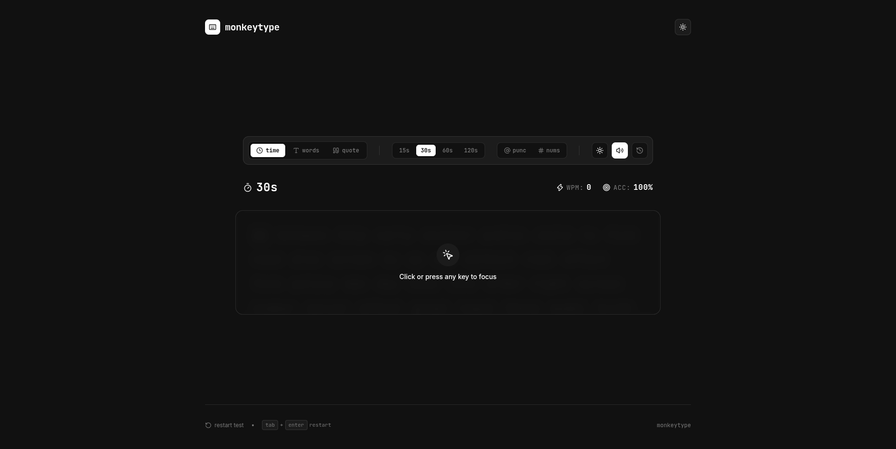

# ⌨️ MonkeyType

A sleek, minimalist typing speed test application inspired by Monkeytype. Challenge your typing speed and accuracy with a clean interface and detailed performance analytics.



## ✨ Features

- **Multiple Test Modes**: Choose between time-based, word-count based, or quote-based typing tests.
- **Customizable Settings**: Toggle punctuation, numbers, and adjust test duration or word count.
- **Real-time Analytics**: Track your WPM (Words Per Minute) and Accuracy as you type.
- **Performance History**: Review your previous tests and track your progress over time.
- **Personal Best**: Automatically tracks and displays your all-time high score.
- **Theming**: Seamlessly switch between Light and Dark modes for a comfortable typing experience.
- **Keyboard Shortcuts**: Quick restart using `tab` + `enter`.
- **Interactive Feedback**: Visual cues for mistakes and a celebratory confetti effect upon completion.

## 🚀 Tech Stack

- **Frontend**: React 19, TypeScript
- **Build Tool**: Vite
- **Styling**: Tailwind CSS v4
- **UI Components**: Radix UI / shadcn/ui
- **Charts**: Recharts (for result visualization)
- **Icons**: Lucide React
- **Effects**: Canvas Confetti

## 🛠️ Installation & Setup

### Prerequisites

- [Node.js](https://nodejs.org/) (LTS version recommended)
- [npm](https://www.npmjs.com/) or [Bun](https://bun.sh/)

### Step-by-Step Installation

1. **Clone the repository**
   ```bash
   git clone https://github.com/your-username/monkeytype-clone.git
   cd monkeytype-clone
   ```

2. **Install dependencies**
   Using npm:
   ```bash
   npm install
   ```
   Or using Bun:
   ```bash
   bun install
   ```

3. **Run the development server**
   Using npm:
   ```bash
   npm run dev
   ```
   Or using Bun:
   ```bash
   bun run dev
   ```

4. **Open the app**
   Navigate to `http://localhost:5173` in your browser.

## 📦 Build for Production

To create an optimized production build:

```bash
npm run build
# or
bun run build
```

The build output will be available in the `dist/` folder.
